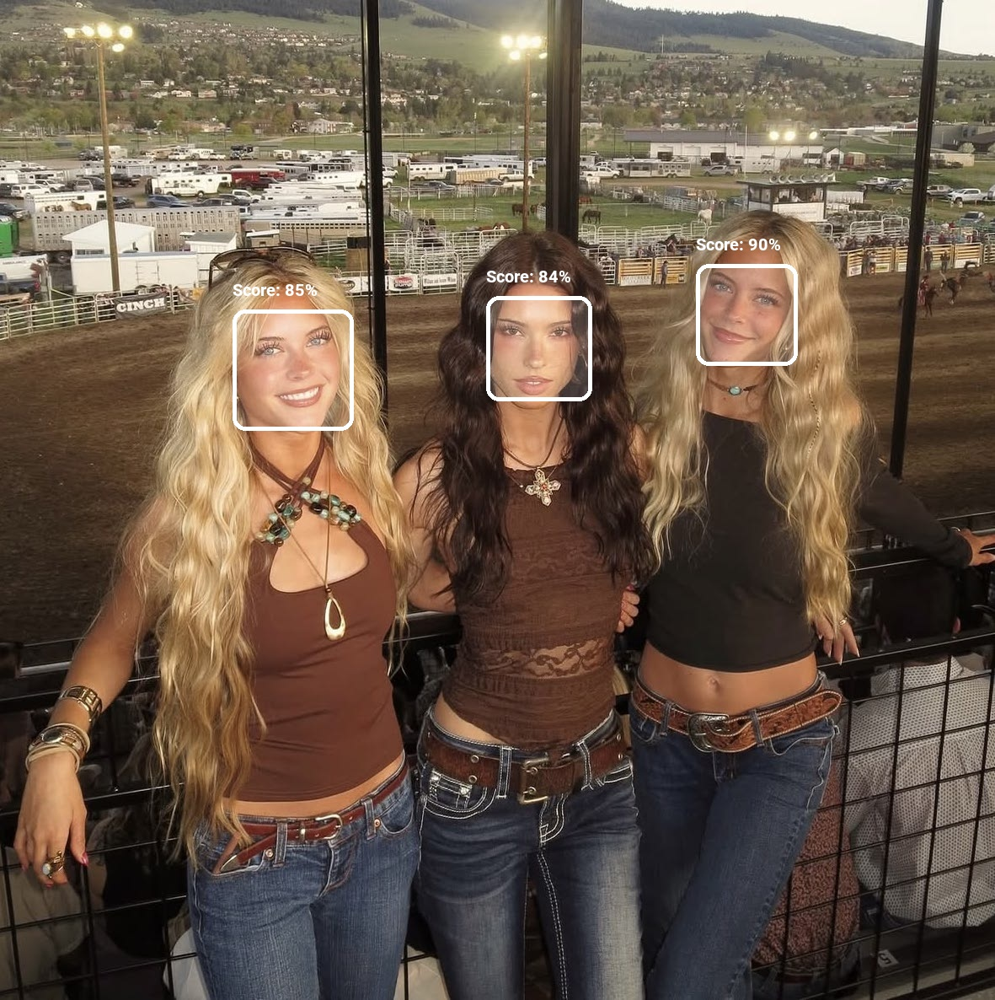
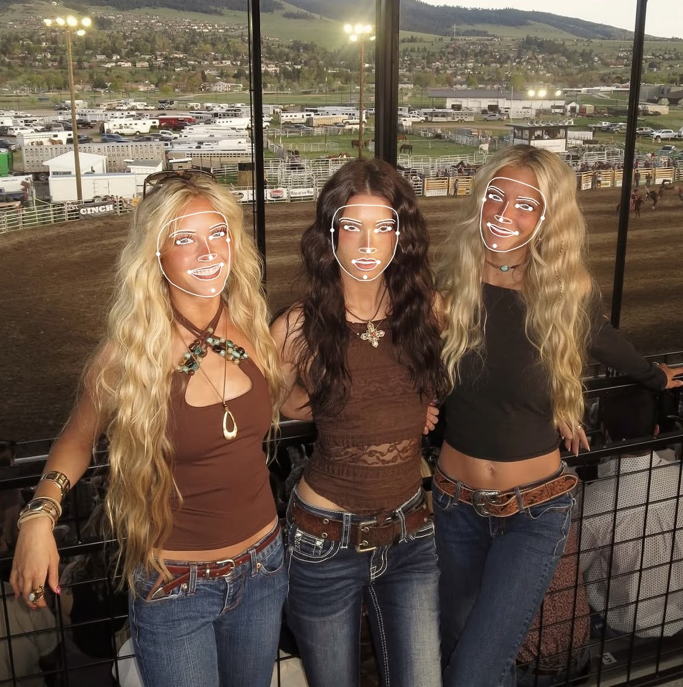
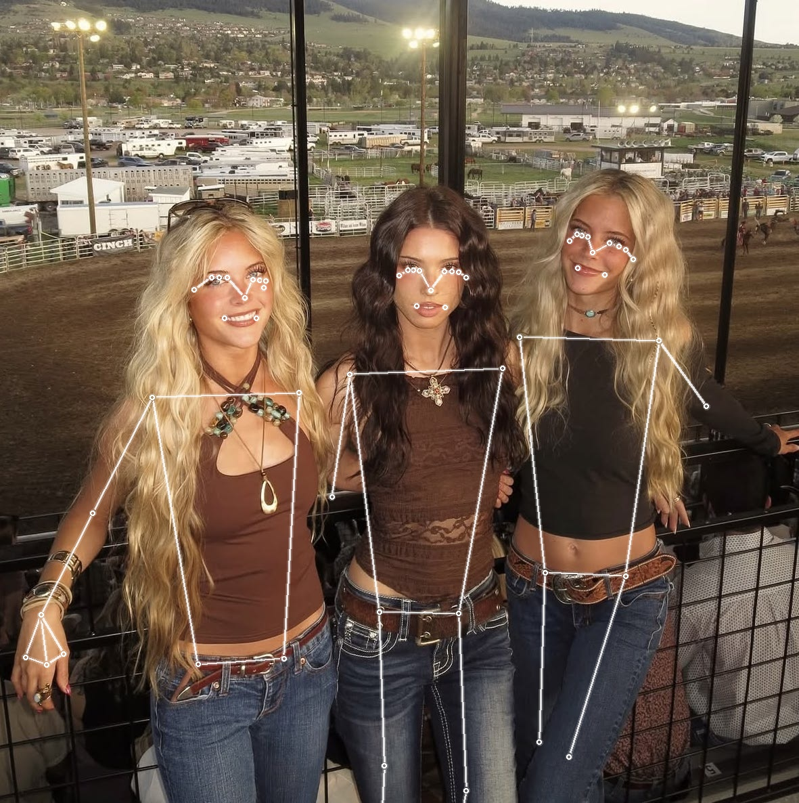
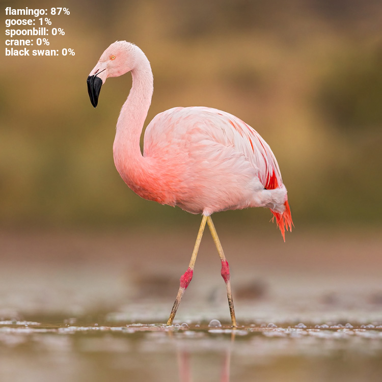
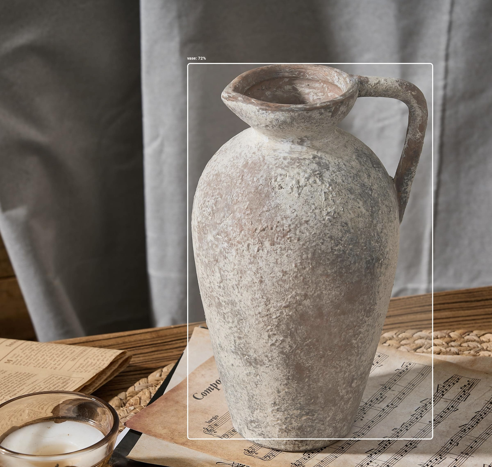
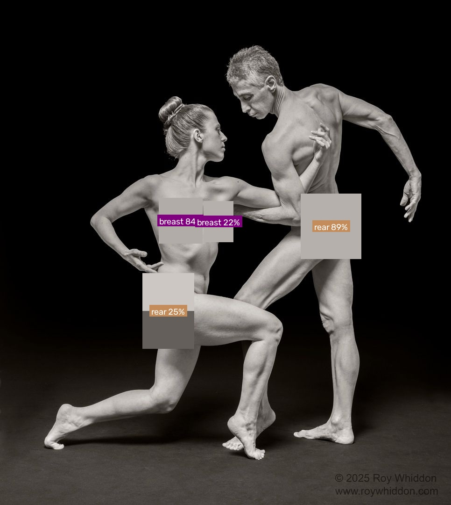
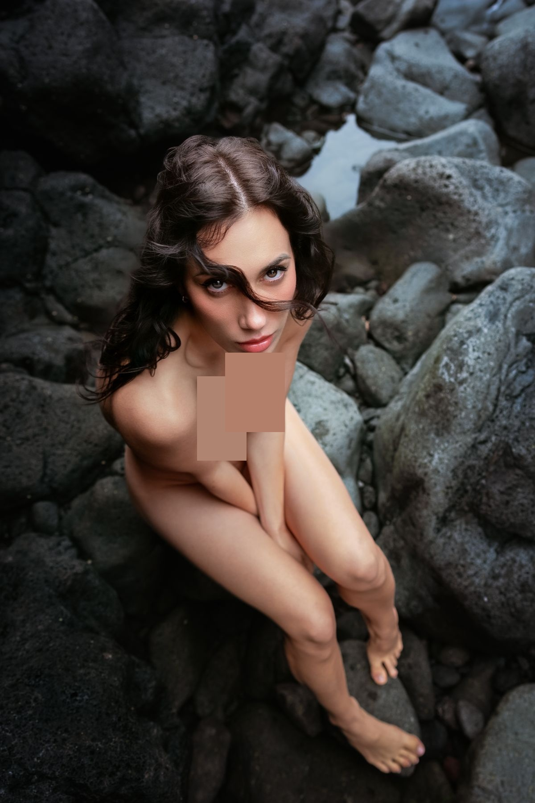

# Vision Classification

<table>
  <tr>
    <td></td>
    <td></td>
    <td></td>
  </tr>
   <tr>
    <td></td>
    <td></td>
    <td></td>
  </tr>
  <tr>
    <td></td>
    <td></td>
    <td></td>
  </tr>
</table>

## Stack
- [FastAPI](https://fastapi.tiangolo.com)
- [MediaPipe](https://ai.google.dev/edge/mediapipe/solutions/guide)
- [Python](https://www.python.org)
- [Docker](https://docker.com)

## Tasks
Depending on the model you choose the following tasks are available:
- Face detection
- Face landmark detection
- Age detection
- Sensitive content detection

A public list of useable models can be found [here](https://huggingface.co/models?pipeline_tag=image-classification&library=onnx,transformers.js&sort=trending).

## Installation

- For ease of use it's recommended to use the provided [compose.yml](https://github.com/doppeltilde/vision_classification/blob/main/compose.yml).

```yml
services:
  vision_classification:
    image: ghcr.io/doppeltilde/vision_classification:latest
    ports:
      - "8000:8000"
    volumes:
      - ./images:/app/images:rw
      - ./models:/root/.cache/huggingface/hub:rw
      - ./mediapipe_models:/app/mediapipe_models:rw
      - ./models:/app/models:rw
    env_file:
      - .env
    restart: unless-stopped
```

> [!CAUTION]
> When using [Docker Swarm](https://github.com/doppeltilde/vision_classification/blob/main/compose.swarm.yml), ensure that all necessary volumes are created and accessible before deployment.

> [!TIP]
> You can find code examples in the [`examples`](./examples/) folder.


> [!IMPORTANT]
> Set the log level to DEBUG, this will generate an api key, hash, and salt for you.
> Just don't forget to set it back to INFO!


## Environment Variables
- Create a [`.env`](https://github.com/doppeltilde/vision_classification/blob/main/.env.example) file and set the preferred values.
```sh
LOG_LEVEL=INFO

# The default model used when no other is set.
DEFAULT_MODEL_NAME=
# Hugging Face access token used to access private models.
ACCESS_TOKEN=
# Set a custom secret, so that images can be accessed by url.
IMAGE_SIGNING_SECRET=

# False == Public Access
# True == Access Only with API Key
USE_API_KEY="False"
API_KEY_HASH="<YOUR_GENERATED_KEY_HASH_HERE>"
API_KEY_SALT="<YOUR_GENERATED_SALT_HERE>"

DEFAULT_IMAGE_CLASSIFICATION_MODEL_URL=https://storage.googleapis.com/mediapipe-models/image_classifier/efficientnet_lite2/float32/latest/efficientnet_lite2.tflite
DEFAULT_FACE_DETECTION_MODEL_URL=https://storage.googleapis.com/mediapipe-models/face_detector/blaze_face_full_range/float16/latest/blaze_face_full_range.tflite
DEFAULT_FACE_LANDMARK_MODEL_URL=https://storage.googleapis.com/mediapipe-models/face_landmarker/face_landmarker/float16/latest/face_landmarker.task
DEFAULT_GESTURE_RECOGNITION_MODEL_URL=https://storage.googleapis.com/mediapipe-models/gesture_recognizer/gesture_recognizer/float16/latest/gesture_recognizer.task
DEFAULT_OBJECT_DETECTION_MODEL_URL=https://storage.googleapis.com/mediapipe-models/object_detector/efficientdet_lite0/float16/latest/efficientdet_lite0.tflite
DEFAULT_POSE_LANDMARKER_MODEL_URL=https://storage.googleapis.com/mediapipe-models/pose_landmarker/pose_landmarker_heavy/float16/latest/pose_landmarker_heavy.task
```

## Usage

> [!TIP]
> Interactive API documentation can be found at: http://localhost:8000/docs

The API is divided into distinct categories: Classify Images, MediaPipe Tasks, and Dedicated Sensitive Object Detection Task.

#### Classify Images
The **Classify Images** endpoint leverages state-of-the-art models from Hugging Face to perform image classification. It processes input images and returns classification results, including predicted labels and associated confidence scores, based on the selected pre-trained model.

#### Mediapipe tasks
The **MediaPipe Tasks** endpoint utilizes Google's MediaPipe framework to perform various computer vision tasks. It currently exposes the following features:
- **Image Classification**  
  Identifies what an image represents among a set of categories defined at training time.

- **Face Detection**  
  Detects one or more human faces in an image. In addition to returning bounding boxes and detection confidence scores, this task supports:
  - Automatic cropping and saving of detected face regions
  - Extraction and saving of facial landmark coordinates for further processing or analysis

- **Pose Landmark Detection**  
  Identifies and tracks the human body pose by detecting key anatomical landmarks (such as shoulders, elbows, wrists, hips, knees, ankles, etc.). The module returns the coordinates of each landmark along with visibility and presence scores.

- **Object Detection**
- **Hand Landmark Detection**

#### Dedicated Sensitive Object Detection Task
All tasks label images with specified categories, apply pixilation, face censoring, and optionally return URLs.
- **YOLO11 Model**
- **LiteRT Model**

> [!NOTE]
> Please be aware that the initial classification process may require some time, as the model is being downloaded.

---
_Notice:_ _This project was initally created to be used in-house, as such the
development is first and foremost aligned with the internal requirements._
